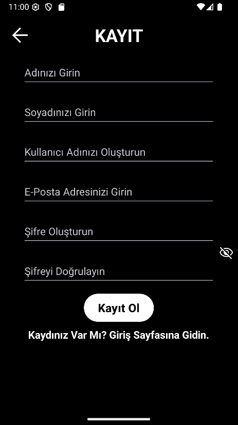
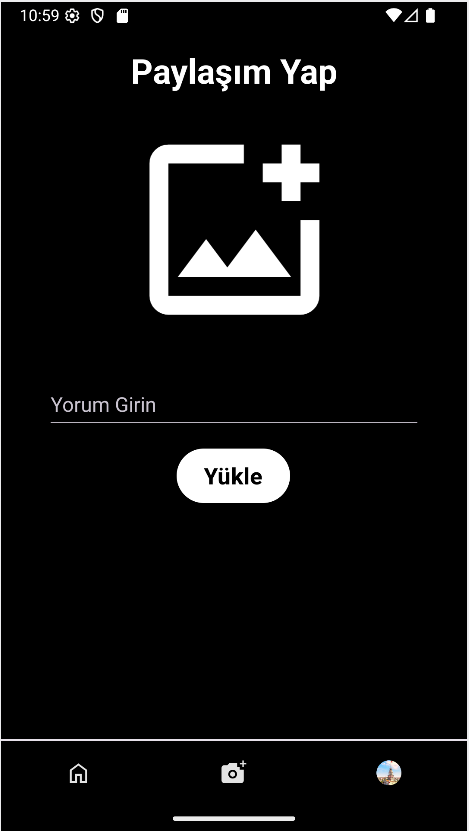
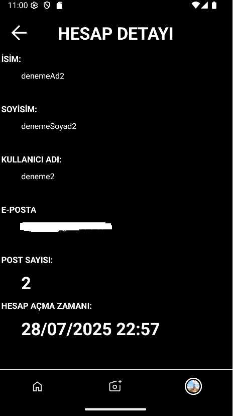

# Hacostagram

Bu proje, Android üzerinde ölçeklenebilir ve modüler bir mimari kullanarak “Instagram mantığını” basit ama güçlü bir şekilde hayata geçiriyor. Yeni başlayanlardan ileri düzey geliştiricilere kadar herkesin üzerine inşa edebileceği bir temel sunuyor.

---

## Demo Görünümler

<table>
  <tr>
    <td></td>
    <td></td>
    <td></td>
  </tr>
  <tr>
    <td></td>
    <td></td>
    <td></td>
  </tr>
  <tr>
    <td></td>
    <td></td>
    <td></td>
  </tr>
  <tr>
    <td></td>
    <td></td>
    <td></td>
  </tr>
</table>

---

## 🚀 Genel Bakış
- **Teknolojiler:** Kotlin, Jetpack Navigation, ViewModel & LiveData (MVVM), Firebase Auth & Firestore (offline persistence), Cloudinary (unsigned upload), Picasso (image loading), Material Components.
- **Mimari:**
   - MVVM ile katmanlı yapı
   - Navigation Component ile tutarlı gezinti
   - Uygulama yaşam döngüsü takibi için `Application` sınıfı

---

## ✨ Öne Çıkan Özellikler

### 1. Kayıt ve Kimlik Doğrulama
- **Kayıt:** Ad‑Soyad, Kullanıcı Adı, E‑posta, Şifre
- **E‑posta Doğrulama:** Kayıt sonrası doğrulama maili gönderilir
- **Giriş:** E‑posta veya kullanıcı adı ile giriş
- **Şifre Sıfırlama:** Kullanıcı adı + e‑posta kontrolü sonrası reset maili

### 2. Güvenlik ve Hesap Yönetimi
- **Şifre Değiştirme:** Eski şifre kontrolü, yeni şifre eşleşmesi
- **Hesap Silme:** Tüm gönderiler, profiller ve Firestore verisiyle kalıcı silme
- **Oturum Dinleme:** Şifre değişikliğinde veya oturum geçersizleştiğinde anında yönlendirme

### 3. Gönderi (Post) Yönetimi
- **Yükleme:**
   - JPEG doğrulaması (header check)
   - Cloudinary’a unsigned upload
   - Otomatik “q_auto,f_auto” optimizasyon
- **Yorum Ekleme:** 30 karakter/kelime limiti, geçersiz karakter filtresi
- **Gerçek Zamanlı Güncellemeler:** `FeedEventsBus` ile yeni gönderi, yorum güncelleme, silme bildirimleri

### 4. Besleme (Feed) Ekranı
- **Listeleme:** `RecyclerView + DiffUtil + ListAdapter`
- **Profil Fotoğrafı Yenileme:** Payload tabanlı, sadece değişen öğeyi güncelleme
- **Navigasyon:** Kullanıcı adına tıklayınca profil sayfasına yönlendirme

### 5. Profil ve Hesap Detayları
- **Profil Görünümü:**
   - Gönderi listesi (düzenle / sil menüsü)
   - Profil fotoğrafı yükleme, silme, güncelleme
- **Hesap Detayları:** İsim, soyisim, kullanıcı adı, e‑posta, kayıt tarihi
- **Dinamik Alt Menü:** DrawerLayout üzerinden detay, şifre değiştir, hesap sil, çıkış

### 6. Alt Navigasyon (Bottom Nav)
- **Dinamik İkonlar:**
   - Feed, Yükleme, Profil
   - Profil ikonu için özel `Drawable` + halka efekti
- **Tutarlı Seçili Durum:** Back-stack ve yeniden seçim davranışları

---

## 🏗️ Proje Mimarisi & Paket Yapısı

- **application**  
  Uygulama genel ayarları, Firestore persistence ve Auth listener
- **model**  
  Data sınıfları (`Posts`)
- **util**  
  Yardımcı sınıflar (`FeedEventsBus`)
- **adapter**  
  `RecyclerView` adaptörleri (`PostAdapter`, `ProfilPostAdapter`)
- **view**  
  Fragment’lar (Giriş, Kayıt, Feed, Profil, Upload vb.)
- **viewmodel**  
  MVVM ViewModel’lar (`ProfilViewModel`, `feedViewModel`)
- **res**  
  XML kaynakları (layout, menu, drawable, renkler)

---

## ⚙️ Kurulum ve Çalıştırma

1. **Depoyu Klonlayın**
   ```bash
   git clone https://github.com/rjhtctn/hacostagram.git
   ```
2. **Android Studio’da Açın**
   - `app/` modülünü import edin
   - Gerekli SDK ve iş yüklerini yükleyin
3. **Firebase Ayarları**
   - `google-services.json` dosyasını `app/` dizinine ekleyin
   - Firestore offline persistence aktif
4. **Cloudinary**
   - `BuildConfig.CLOUD_PRESET` değerini preset’inizle güncelleyin
5. **Çalıştırın**
   - Bir Android cihaz veya emulator seçin
   - Uygulamayı başlatın  


